# 虚谷数据库监控系统（xugu-exporter）产品手册

**版本**：v1.2.0
**适用数据库**：虚谷数据库（XuguDB）12.x 系列
**文档类别**：产品说明

---

## 1. 产品概述

xugu-exporter 是面向虚谷数据库的 Prometheus 监控采集与可视化套件，提供数据库运行状态、性能、容量、锁与事务、日志与安全、服务器资源的完整监控能力。产品由指标采集器、Grafana 仪表盘、Prometheus 告警规则与自动化验证工具四部分组成，开箱即用，亦支持不修改代码的深度定制。

指标体系与虚谷数据库系统字典深度对齐，全部指标附带中文统计口径说明。

## 2. 系统架构与组成

```
┌──────────────┐  SQL   ┌───────────────┐  HTTP /metrics  ┌────────────┐      ┌─────────┐
│  XuguDB      │◄───────│ xugu-exporter │────────────────►│ Prometheus │─────►│ Grafana │
│ (SYSTEM 库)  │        │  (单二进制)    │                 │ (含告警规则) │      │ (仪表盘) │
└──────────────┘        └───────────────┘                 └────────────┘      └─────────┘
```

| 组件 | 交付物 | 说明 |
|------|--------|------|
| 指标采集器 | 六平台二进制（bin/） | 48 个采集域，88 个数据库指标；内置服务器资源采集 |
| 可视化 | dashboards/xugu-overview.json | Grafana 仪表盘，10 个功能分区、70 个面板 |
| 告警 | rules/xugu-alerts.yml | 29 条 Prometheus 告警规则，中文说明与处置指引 |
| 部署套件 | deploy/ | Docker Compose 演示栈、systemd 单元、Prometheus/Grafana 配置模板 |
| 环境自检工具 | tools/verify 等 | 部署后与数据库版本变更后的一键回归自检 |

## 3. 功能规格

### 3.1 功能说明（按分区）

以下按仪表盘分区说明各功能的用途、正常表现与异常识别方法。

#### 总览

- **用途**：一屏判断数据库整体健康度。两排 KPI 覆盖可用性、连接、事务、锁、慢 SQL、错误、磁盘余量与采集健康。
- **正常表现**：实例状态"正常"（绿）；连接使用率低于 80%；锁等待为 0；采集失败域为 0；磁盘剩余最低高于 20%。
- **异常表现与处置**：实例状态"宕机"（红）→ 数据库不可连接，检查进程与网络；连接使用率进入橙/红区 → 接近 max_conn_num 上限，排查连接泄漏或调大参数；最长事务时长持续增长 → 转锁与事务分区排查（可能为行锁互等）；采集失败域 > 0 → 对应面板无数据，查采集器日志。

#### 会话与 SQL

- **用途**：定位连接来源、识别失控查询、追踪慢 SQL。
- **正常表现**：会话状态以"空闲"为主；最长执行语句在秒级波动；慢 SQL 窗口计数低位。
- **异常表现与处置**：某库/用户会话数突增 → 来源分布图定位应用；最长执行语句持续攀升 → 在"正在执行的 SQL"表按 OS 线程号执行 `pstack <线程号>` 抓取堆栈（或运行 scripts/diagnose-stuck-sql.sh）；慢 SQL 突增 → Top 慢 SQL 明细表直接查看语句文本、用户与来源 IP。

#### 会话属性（默认折叠）

- **用途**：连接配置画像与配置漂移发现——字符集、时区、自动提交、隔离级别、兼容模式、空串转 NULL、严格提交、锁超时、关键字过滤、应用名十类属性的取值分布；保持最久连接明细；连接保持时长与会话内存。
- **正常表现**：同一属性只有预期内的取值（如字符集统一 UTF8）；最久连接为已知的常驻连接池。
- **异常表现与处置**：同一属性出现多个取值 → 存在配置漂移（如部分应用未设字符集导致乱码风险）；出现意外兼容模式/时区 → 核对应用连接串；未知来源的长保持连接 → 按 IP/用户定位应用；单会话内存峰值异常 → 存在大结果集或大排序操作。说明：SSL 加密为连接串侧属性，服务端无会话级视图，无法在会话维度监控。

#### 性能

- **用途**：观察 IO 压力、写入负载与内存缓冲健康。
- **正常表现**：WAL 写入速率与业务写入量正相关；检查点延迟呈锯齿状回落；缓冲池空闲充足。
- **异常表现与处置**：物理读持续高 → 缓冲池偏小或存在大扫描（注意：数据全在缓冲池时物理读为 0 属正常）；检查点延迟持续超过 2GB 不回落 → 检查刷盘配置，宕机恢复时间将变长；脏页占比持续走高 → 写盘能力不足。

#### 容量

- **用途**：按虚谷存储模型（物理空间/逻辑分配/逻辑占用/空闲可复用）监控数据文件与磁盘余量。
- **正常表现**：数据文件按 STEP_SIZE 台阶式扩展（扩展检测图出现台阶属正常行为）；已分配使用率高不构成风险；空闲可复用空间随删除/整理回升。
- **异常表现与处置**：磁盘剩余最低进入橙/红区或 7 天预测线触 0 → 数据文件扩展将耗尽磁盘，扩容或清理；介质错误 > 0 → 磁盘硬件故障，立即检查存储设备；扩展过于频繁 → 关注写入放大与磁盘余量。

#### 锁与事务

- **用途**：发现阻塞、定位持有者、监控事务健康。
- **正常表现**：锁等待为 0；阻塞链表格为空；两种口径的活跃事务数基本一致。
- **异常表现与处置**：锁等待 > 0 → 阻塞链表格给出"等待事务 ← 持有会话 SID + 锁类型 + 对象名"，确认后 `EXEC DBMS_DBA.KILL_TRANS(节点ID, 事务ID);`；最长事务持续增长且阻塞链为空 → 大概率为行级锁互等（行锁不进入锁等待视图，包括死锁场景，该版本无死锁自动检测），结合"正在执行的 SQL"与排他锁持有明细定位后人工终止。

#### 线程与对象

- **用途**：内核线程健康、L06 风险预警、失效对象、执行中 SQL、三级存储分布与碎片。
- **正常表现**：工作线程以"空闲/运行中"为主；事务号差远低于 600 万；失效对象为 0；碎片率低位。
- **异常表现与处置**：等锁/等资源类线程状态持续偏高 → 结合锁分区与 IO 排查；事务号差超 300 万告警 → 存在长期不结束的事务，600 万将触发 L06 陈旧事务异常；失效对象 > 0 → 用 always-sql/依赖对象重编译.sql 生成修复脚本；碎片率超阈值 → 标记删除行占比高，安排存储整理。

#### 集群拓扑（单机默认折叠）

- **用途**：节点存活、角色、存储段健康与节点间通讯质量。
- **正常表现**：全部节点状态"正常"；存储段状态码 1；消息重发/丢弃计数不增长。
- **异常表现与处置**：节点状态出错/宕机 → 检查节点进程与心跳网络；存储段非健康态持续 → 扩容/修复中属正常，长期不恢复检查存储副本；消息重发/丢弃增长 → 节点间网络异常。

#### 日志 / 安全 / 自监控（默认折叠）

- **用途**：错误分级趋势、重要错误明细、连接断开、安全事件与采集器自身健康。
- **正常表现**：错误日志以低级别为主；重要级错误明细为空；无锁定账号与封禁 IP。
- **异常表现与处置**：SYSEX/MEMER 级出现 → 系统级故障，结合致命错误告警与 trc 文件处置；DLOCK 出现 → 数据库上报了死锁事件；NETER 持续增长 → 网络不稳或客户端异常退出；账号锁定/IP 封禁 → 核实是否暴力破解。

#### 服务器资源

- **用途**：数据库服务器 CPU/内存/磁盘与进程存活、异常堆栈文件检测（采集器内置，开箱即用）。
- **正常表现**：数据库进程显示"运行中"（虚谷为单进程架构，每节点一个进程）；异常堆栈显示"无"；可用内存高于 20%。
- **异常表现与处置**：可用内存低于 10% → OOM 风险，数据库进程可能被系统终止；异常堆栈显示"存在" → 数据库目录发现 exception_stack.trc（E19002 系统存取保护事故生成，单文件追加写），将文件提交原厂映射解析，处理后移走文件；文件内容再次追加（XuguTrcFileGrowing 告警）→ 发生了新的崩溃事件；进程"未检测到"且实例宕机 → 数据库进程已退出，结合 trc 文件与事件日志定位。

#### 备份检测

- **用途**：备份与归档文件的落地实况监控（扫描 mount.ini 的 /BACKUP、/ARCH 物理目录），与备份计划配置互补。
- **正常表现**：备份目录文件数随备份周期稳定增长；备份新鲜度（最新文件距今）在备份周期内。
- **异常表现与处置**：备份计划已启用但文件数为 0（XuguBackupMissing）→ 备份未真正落地，检查备份执行日志与目录权限；备份新鲜度超过 24 小时（XuguBackupStale）→ 恢复点老化，检查备份计划是否正常执行、备份磁盘是否可写。说明：本功能反映备份文件"落地实况"，SYS_BACKUP_PLANS 反映备份"计划配置"，两者互补。

### 3.2 采集器技术特性

| 特性 | 规格 |
|------|------|
| 部署形态 | 单二进制，静态编译，无外部依赖 |
| 采集方式 | 配置驱动：全部采集 SQL 外置于 YAML，支持外置文件覆盖同名采集域 |
| 单机/集群一体化 | 统一使用 SYS_ALL_ 全局虚表；集群专属采集域按节点数自动启停 |
| 结果缓存 | 采集域级 TTL 缓存；支持全局 default_ttl 统一降频 |
| 错误隔离 | 单采集域失败不影响其他域，失败状态通过 xugu_collector_success 指标暴露 |
| 序列保护 | 采集引擎内置重复时间序列去重，保障自定义 SQL 场景下指标输出可用性 |
| 服务器资源采集 | 内置跨平台主机采集（CPU/内存/磁盘），可配置关闭 |
| 参数辅助 | 支持启动时自动设置数据库慢 SQL 阈值（set_slow_sql_time） |
| 自监控 | 抓取总耗时、各采集域耗时与成败状态 |

### 3.3 指标体系

- 数据库指标 88 项（48 个采集域），完整清单与来源 SQL 对照见《metrics-reference.md》；
- 引擎指标 4 项（可用性、抓取耗时、采集域成败/耗时）；
- 服务器与进程指标 11 项（xugu_host_ / xugu_trc_ 前缀：CPU/内存/磁盘/数据库进程存活/异常堆栈文件）；
- 命名遵循 Prometheus 规范：容量 `_bytes`、时刻 `_timestamp_seconds`、时长 `_seconds`、累计 `_total`；
- 全部指标携带中文 help，注明统计口径与适用限制。

### 3.4 告警规格（27 条）

| 分组 | 规则 | 触发条件 | 级别 |
|------|------|----------|------|
| 可用性 | XuguInstanceDown | 数据库连续 1 分钟不可连接 | critical |
| 可用性 | XuguExporterCollectorFailed | 采集域持续失败 10 分钟 | warning |
| 可用性 | XuguNodeRestarted | 节点启动时间在 5 分钟内 | warning |
| 连接 | XuguTooManySessions / XuguSessionsSaturated | 会话数超上限 80%（5m）/ 95%（1m） | warning / critical |
| 性能 | XuguSlowSQLBurst | 近 10 分钟慢 SQL 超过 20 条 | warning |
| 性能 | XuguCheckpointLagHigh | 检查点延迟超过 2GB，持续 10 分钟 | warning |
| 性能 | XuguLongStatement | 单语句执行超过 10 分钟 | warning |
| 锁与事务 | XuguLockWaiting | 表级锁等待持续 3 分钟 | warning |
| 锁与事务 | XuguLongTransaction | 最老事务超过 30 分钟 | warning |
| 锁与事务 | XuguTransIdSpanHigh | 活动事务号差超过 300 万 | warning |
| 致命错误 | XuguFatalError | 出现 19002/19003/19016/19017/14001 错误码 | critical |
| 致命错误 | XuguTrcFileDetected | 数据库目录存在异常堆栈文件 | critical |
| 致命错误 | XuguTrcFileGrowing | 异常堆栈文件出现新增内容（新崩溃） | critical |
| 致命错误 | XuguDBProcessMissing | 本机未检测到数据库进程（同机部署） | warning |
| 容量 | XuguTablespaceMediaError | 数据文件介质错误 | critical |
| 主机 | XuguHostMemoryLow | 可用内存低于 10%，持续 5 分钟 | warning |
| 主机 | XuguHostDiskLow | 磁盘分区剩余低于 10%，持续 10 分钟 | warning |
| 主机 | XuguHostDiskFullIn7Days | 按 1 天趋势外推 7 天内磁盘写满 | warning |
| 主机 | XuguDatafileExtended | 数据文件发生自动扩展 | info |
| 日志 | XuguErrorLogBurst | 5 分钟内 ERROR 级日志新增超过 50 条 | warning |
| 集群 | XuguClusterNodeAbnormal | 节点状态码非正常值 | critical |
| 集群 | XuguClusterNodeCountChanged | 集群节点数量变化 | warning |
| 集群 | XuguGlobalLockWaiting | 全局锁等待超过 10，持续 5 分钟 | warning |
| 集群 | XuguStoreAbnormal | 存储段非健康状态持续 30 分钟 | warning |
| 安全 | XuguAccountLocked | 存在锁定账号超过 10 分钟 | info |
| 安全 | XuguForbiddenIPDetected | 30 分钟内出现新增封禁 IP | warning |

> 容量说明：数据文件为自动扩展模式，已分配空间使用率不设告警；容量风险统一以数据文件所在磁盘的剩余空间衡量。

## 4. 运行环境

| 项目 | 要求 |
|------|------|
| 数据库 | XuguDB 12.x；监控账号需 SYSTEM 库系统表查询权限 |
| 采集器操作系统 | Linux（x86 32 位 / x86_64 / ARM64）、Windows x86_64、macOS（Intel / Apple Silicon） |
| Prometheus | 2.x / 3.x |
| Grafana | 10.0 及以上 |
| 资源占用 | 采集器常驻内存约 30MB；默认对数据库产生 4 个连接、每抓取周期约 1.5 秒查询耗时（可通过 TTL 降频） |

## 5. 使用说明与已知限制

以下为 XuguDB 12.x 环境下的使用说明与已知限制，详细参考见《xugudb-reference-notes.md》。

1. **连接要求**：采集连接串必须指向 SYSTEM 库；分布式环境可使用 `IPS=ip1,ip2` 多地址负载均衡。
2. **缓冲命中率与网络吞吐**：XuguDB 12.x 不提供相应系统计数器，本产品不包含该两类指标；缓冲健康度由缓冲池使用率与脏页占比反映，写入负载由 WAL 写入速率反映。
3. **行级锁可观测性**：锁等待视图仅记录表级锁；行级锁互等（包括死锁，且该版本不进行死锁自动检测）在监控上表现为长事务。产品通过最长事务时长、事务号差两项指标与对应告警实现兜底发现，处置命令为 `EXEC DBMS_DBA.KILL_TRANS(节点ID, 事务ID);`。
4. **容量口径**：使用率类指标为已分配空间口径。数据文件在 MAX_SIZE=-1 时按 STEP_SIZE 自动扩展，磁盘剩余空间为实际硬限制；系统空间（GSYS/UNDO/LSYS）无空闲显示属正常形态；逻辑空闲空间可复用，物理文件不自动收缩。
5. **服务器资源指标口径**：xugu_host_ 指标反映采集器所在主机。采集器与数据库同机部署时即数据库服务器资源；异机部署应设置 `host_metrics: false`，并在数据库服务器部署 node_exporter（Linux）或 windows_exporter（Windows）。
6. **日志类计数器**：日志表按 errlog_size（默认 100MB）滚动归档，归档时累计计数回落，速率曲线出现短暂负值后恢复属正常现象。
7. **明细文本长度**：SQL 明细截断至 500 字符、错误信息截断至 300 字符；表格单元格支持点击放大查看，完整文本可按时间戳在数据库中查询。
8. **采集器自身可见性**：活跃会话、正在执行的 SQL 等实时视图包含采集器自身的查询；排他锁持有明细已过滤系统表自锁。
9. **性能控制**：提供三层控制手段——按域关停（disabled_groups）、全局降频（default_ttl）、整体关停并白名单启用（disable_default_metrics + metrics_files）。errorlog 采集域为日志表全量扫描，日志规模较大的环境建议优先配置。
10. **集群指标**：全局锁、集群消息等采集域在单机环境自动停用；集群环境下的字段有效性建议使用随附验证工具复验。

## 6. 定制能力

| 定制项 | 方式 |
|--------|------|
| 修改/新增采集 SQL | 外置 metrics_files YAML 文件，同名采集域覆盖内置定义，无需重新编译 |
| 修改仪表盘 | 编辑 tools/gen_dashboard.py 后重新生成，生成过程自动校验指标引用有效性 |
| 修改告警阈值 | 直接编辑 rules/xugu-alerts.yml |
| 环境回归自检 | 运行 tools/verify，一键完成采集与指标体系的环境适配性检查 |

## 7. 功能图文详解（按分区逐面板）

本章按仪表盘分区逐一说明全部面板：展示形式、涉及指标、功能与判读方法。
指标的采集 SQL 与口径详见《指标参考手册》。

### 7.1 总览

#### 实例状态（数值卡）


**涉及指标**：`xugu_up`

**说明**：Exporter 能否连接数据库

#### 版本（数值卡）


**涉及指标**：`xugu_info`

**说明**：数据库版本（来自 VERSION()）

#### 已运行时长（数值卡）


**涉及指标**：`xugu_node_boot_timestamp_seconds`

**说明**：自最早节点启动时间起算

#### 连接使用率（仪表盘）


**涉及指标**：`xugu_max_connections`、`xugu_sessions`

**说明**：当前会话数 / max_conn_num；80% 预警、95% 危险

#### 活跃会话（数值卡）


**涉及指标**：`xugu_sessions_active`

**说明**：正在执行语句的会话数（SYS_ALL_THD_SESSION 口径，含 exporter 自身）

#### 活跃事务（数值卡）


**涉及指标**：`xugu_transactions_active`

**说明**：SYS_ALL_TRANS 口径；等待行锁未获首锁的事务不在此列

#### 磁盘剩余最低（扩展余量）（仪表盘）

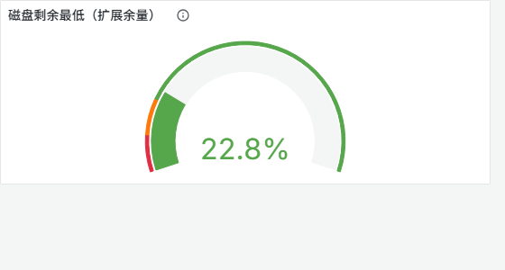

**涉及指标**：`xugu_host_disk_free_bytes`、`xugu_host_disk_total_bytes`

**说明**：各磁盘分区剩余百分比的最小值。数据文件自动扩展，已分配使用率不构成风险，真正的容量约束是数据文件所在磁盘还能提供多少扩展空间；分区明细见服务器资源行

#### 锁等待（表级）（数值卡）


**涉及指标**：`xugu_lock_waiters`

**说明**：仅表级锁等待可见；行锁阻塞表现为长事务（12.0.0 实测限制）

#### 近10分钟慢SQL（数值卡）

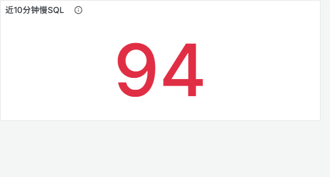

**涉及指标**：`xugu_slowsql_recent`

**说明**：SYS_ALL_SLOWSQL_LOG 近 10 分钟窗口（阈值 slow_sql_time）

#### 近10分钟慢SQL最大耗时（数值卡）

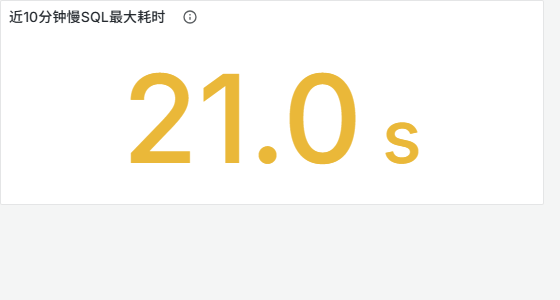

**涉及指标**：`xugu_slowsql_recent_max_duration_seconds`

**说明**：窗口内无慢 SQL 时显示 0

#### 近1小时错误日志（数值卡）


**涉及指标**：`xugu_errorlog_total`

**说明**：ERROR 级别新增条数

#### 最长事务时长（数值卡）


**涉及指标**：`xugu_transaction_oldest_start_timestamp_seconds`

**说明**：持续增长可能是未被检测的行锁死锁（12.0.0 死锁无自动检测），需人工排查

#### 采集失败域（数值卡）


**涉及指标**：`xugu_collector_success`

**说明**：失败的采集域数量；>0 时对应面板无数据，详见日志/自监控行

#### 会话数与连接上限（时序图）

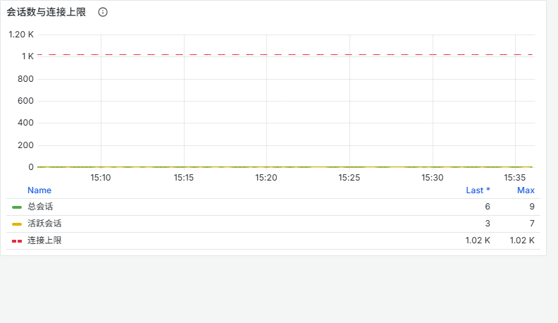

**涉及指标**：`xugu_max_connections`、`xugu_sessions`、`xugu_sessions_active`

**说明**：活跃口径=正在执行语句的会话（THD_SESSION）

#### 事务开启速率（时序图）

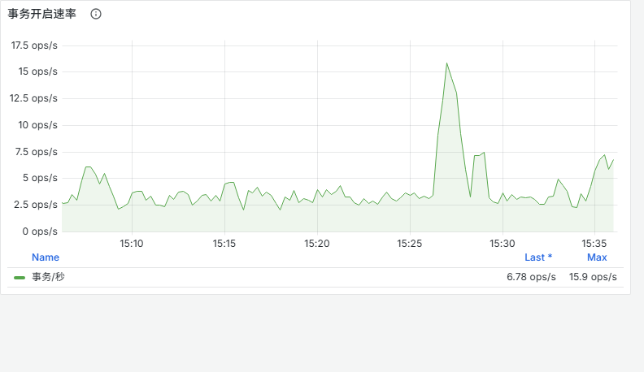

**涉及指标**：`xugu_transaction_id_max`

**说明**：按事务ID高水位推进速率近似 TPS（含数据库内部事务）。12.0.0 的提交/回滚计数器无效，无法区分提交与回滚

### 7.2 会话与 SQL

#### 会话来源分布（库/用户）（时序图）

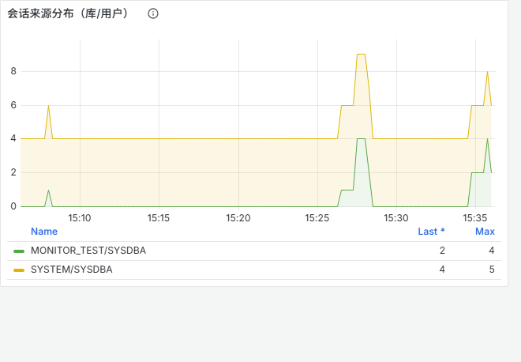

**涉及指标**：`xugu_sessions_by_source`

**说明**：Top10 来源；基数过大时可在 exporter 配置禁用本域

#### 会话状态分布（时序图）

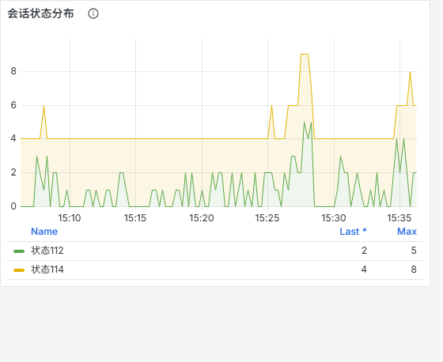

**涉及指标**：`xugu_sessions_by_status`

**说明**：实测：112=空闲，114=执行中；其他状态码请反馈补充映射

#### 会话内存合计（时序图）

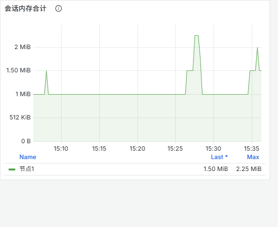

**涉及指标**：`xugu_sessions_memory_bytes`

**说明**：全部会话 MEM_SIZE 之和

#### 最长执行语句 / 最长事务（时序图）

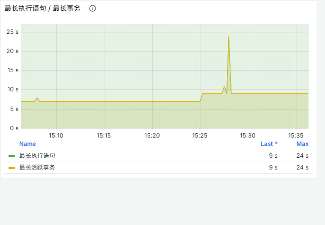

**涉及指标**：`xugu_session_oldest_statement_start_timestamp_seconds`、`xugu_transaction_oldest_start_timestamp_seconds`

**说明**：语句口径=正在执行的命令开始时间；事务持续增长需警惕行锁互等死锁

#### 慢 SQL（近10分钟窗口）（时序图）

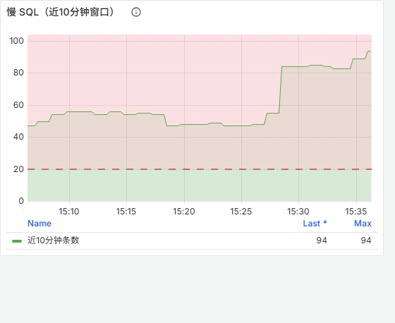

**涉及指标**：`xugu_slowsql_recent`

**说明**：服务器时钟口径的滑动窗口，与告警 XuguSlowSQLBurst 同源

#### 慢 SQL 累计（数值卡）

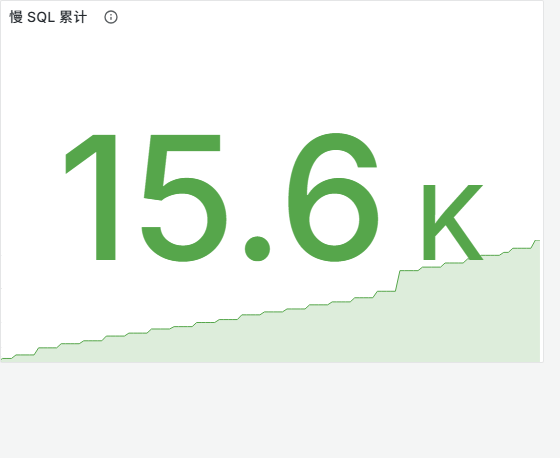

**涉及指标**：`xugu_slowsql_total`

**说明**：日志表累计条数；归档清理时可能回落

#### Top 慢 SQL 明细（近1小时，按耗时）（明细表格）

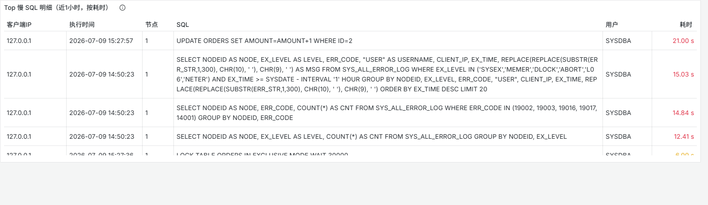

**涉及指标**：`xugu_slowsql_top_duration_seconds`

**说明**：来自 SYS_ALL_SLOWSQL_LOG，语句截断至 500 字符；点击 SQL 单元格可放大查看全文，更长语句按执行时间到库中查询；窗口内无慢 SQL 时本表为空

### 7.3 性能（IO / WAL / 内存）

#### 磁盘 IOPS（时序图）

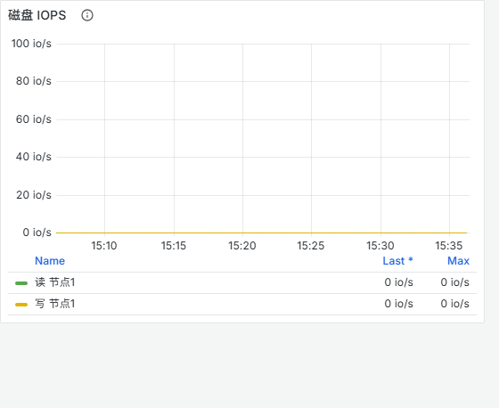

**涉及指标**：`xugu_disk_reads_total`、`xugu_disk_writes_total`

**说明**：物理 IO：数据全在缓冲池时读为 0、脏页懒刷盘时写滞后，均属正常；写负载实时性看 WAL

#### 磁盘吞吐（时序图）

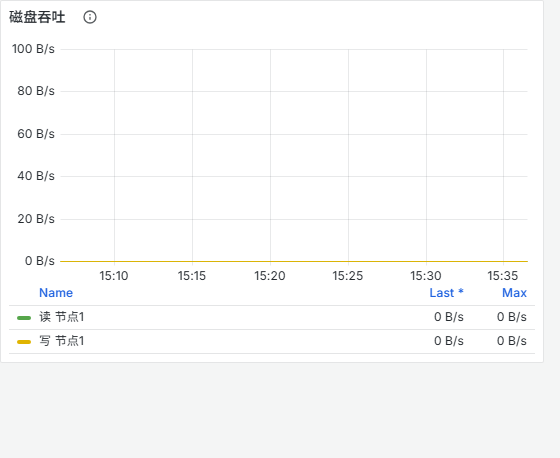

**涉及指标**：`xugu_disk_read_bytes_total`、`xugu_disk_written_bytes_total`

**说明**：物理读写字节速率（与 IOPS 面板同源不同单位）：读吞吐高说明缓冲池未覆盖热数据，写吞吐对应脏页刷盘与 WAL 落盘的合计磁盘压力

#### WAL 写入速率（时序图）

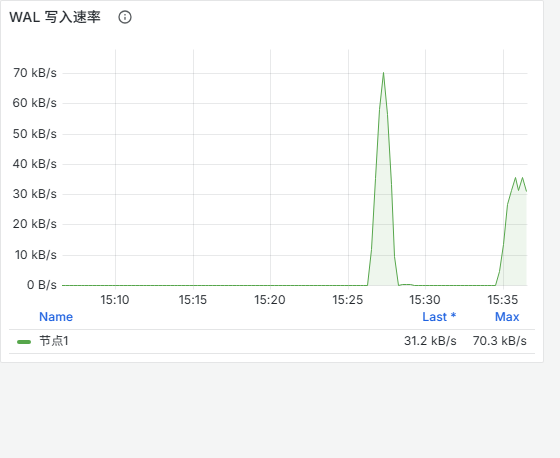

**涉及指标**：`xugu_xlog_write_position`

**说明**：写负载的实时指标（先写 WAL 后刷数据页）

#### WAL 检查点延迟（时序图）

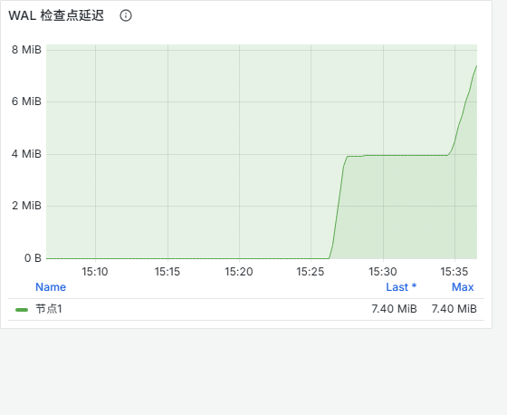

**涉及指标**：`xugu_xlog_checkpoint_position`、`xugu_xlog_write_position`

**说明**：未做检查点的 WAL 字节数；越大宕机恢复越慢，告警阈值 2GB

#### 数据缓冲池（时序图）

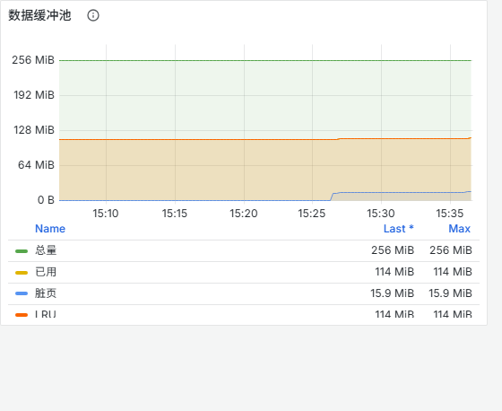

**涉及指标**：`xugu_buffer_pool_bytes`、`xugu_buffer_pool_dirty_bytes`、`xugu_buffer_pool_free_bytes`、`xugu_buffer_pool_lru_bytes`

**说明**：12.0.0 缓冲命中计数器无效，无法计算命中率；以使用率/脏页观察缓冲池健康

#### 内部内存池（时序图）

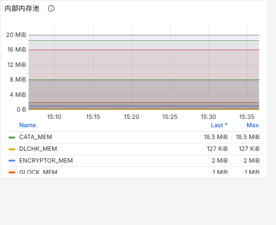

**涉及指标**：`xugu_memory_pool_bytes`

**说明**：CATA=字典 LOCK=锁 TRAN=事务 MSG=消息 NET=网络 MODI=修改 DLCHK=死锁检测 等

### 7.4 容量

#### 已分配空间使用率（DATA/TEMP）（条形图）

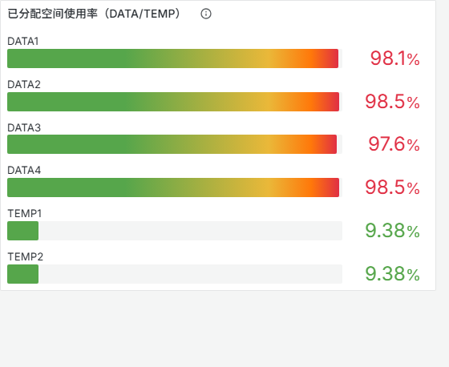

**涉及指标**：`xugu_tablespace_bytes`、`xugu_tablespace_free_bytes`

**说明**：仅 DATA/TEMP 型空间，已分配空间口径（数据文件可自动扩展，硬限制是磁盘空间）；GSYS/UNDO/LSYS 系统空间按需整块分配恒显 100%，不在此列

#### 数据文件逻辑占用（DATA）（时序图）

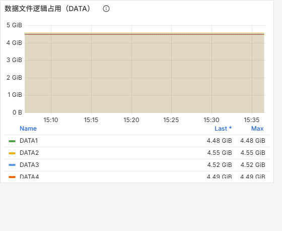

**涉及指标**：`xugu_tablespace_bytes`、`xugu_tablespace_free_bytes`

**说明**：各 DATA 数据文件组内已被存储段实际占用的逻辑空间；持续上升代表真实数据增长，回落代表删除/整理后空间转入可复用池（物理文件不缩小）

#### 数据文件总量 vs 磁盘剩余（时序图）

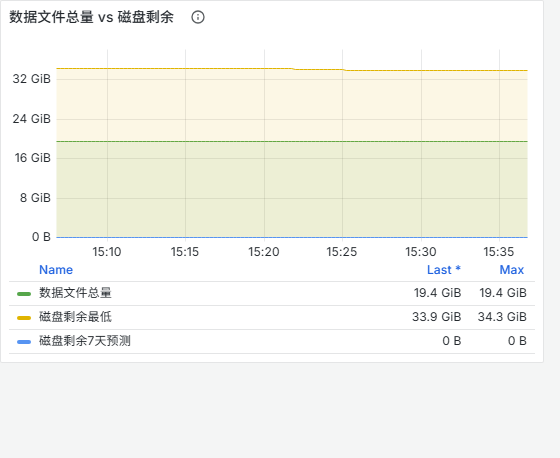

**涉及指标**：`xugu_datafile_bytes`、`xugu_host_disk_free_bytes`

**说明**：数据文件自动扩展消耗磁盘空间：关注磁盘剩余能支撑多久的扩展；预测线触 0 表示按当前趋势 7 天内磁盘写满，需扩容或清理

#### 数据文件分类明细（物理/逻辑口径）（明细表格）

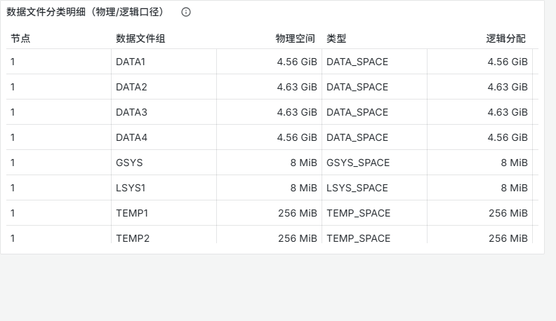

**涉及指标**：`xugu_datafile_bytes`、`xugu_tablespace_bytes`、`xugu_tablespace_free_bytes`

**说明**：物理空间=数据文件在磁盘上的实际大小；逻辑分配=文件内已划分的存储块；逻辑占用=已被存储段使用；空闲可复用=已划分未占用——虚谷逻辑存储不实时回收，该空间可复用但物理文件不会缩小。系统组(GSYS/UNDO/LSYS)恒无空闲属正常

#### 数据文件物理大小（按类型分组）（时序图）

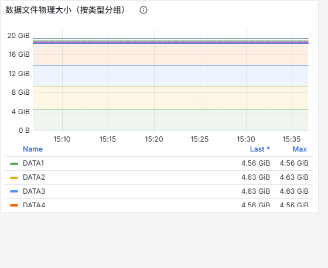

**涉及指标**：`xugu_datafile_bytes`

**说明**：数据文件按 STEP_SIZE 自动扩展(MAX_SIZE=-1 不设上限)，只增不减

#### 介质错误（数值卡）


**涉及指标**：`xugu_tablespace_media_error`

**说明**：数据文件读写校验错误(磁盘介质故障，事件日志 MEDIA_ERR)；>0 立即检查存储设备

#### 数据文件自动扩展检测（1h 增量）（时序图）

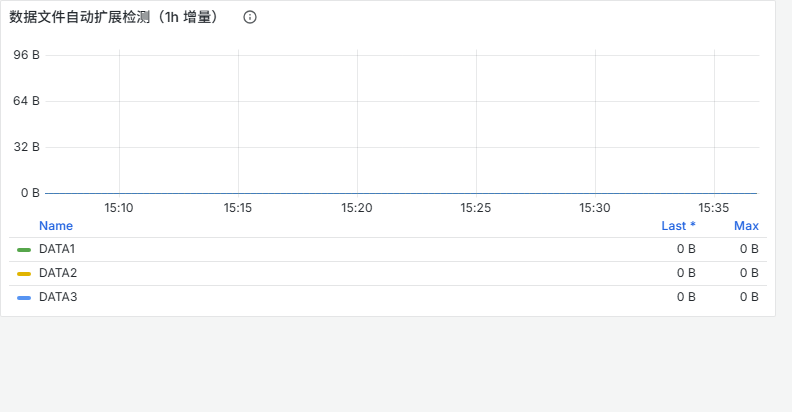

**涉及指标**：`xugu_datafile_bytes`

**说明**：数据文件按 STEP_SIZE(实测64MB) 自动扩展，本图为每小时物理大小增量；出现台阶即发生扩展，频繁扩展说明写入量大，需关注磁盘剩余（服务器资源行）

#### 空闲可复用空间趋势（DATA）（时序图）

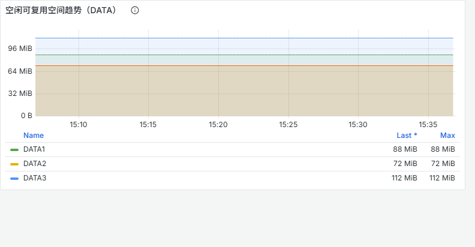

**涉及指标**：`xugu_tablespace_free_bytes`

**说明**：逻辑存储不实时回收：DELETE/整理后空闲块回到此池被复用，物理文件不缩小；此值持续为 0 且文件频繁扩展 = 真实增长

### 7.5 锁与事务

#### 锁等待与持有（时序图）

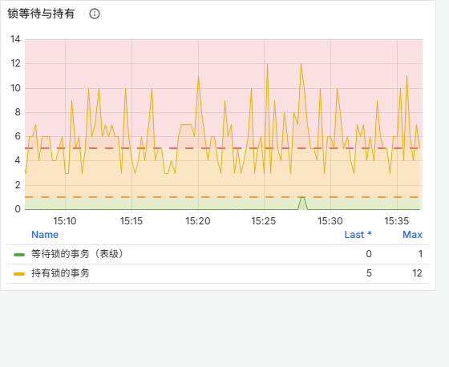

**涉及指标**：`xugu_lock_owners`、`xugu_lock_waiters`

**说明**：行级锁阻塞不产生等待记录（12.0.0 实测），只能通过长事务发现

#### 持有锁数量（按模式）（时序图）

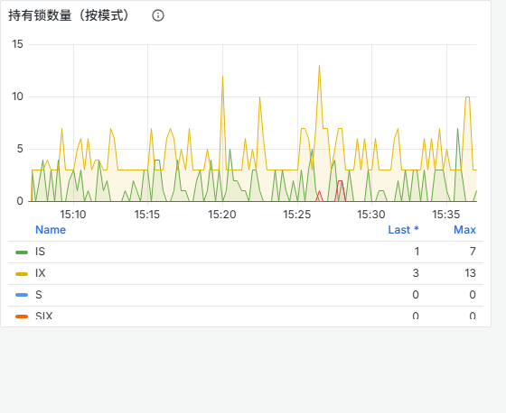

**涉及指标**：`xugu_locks`

**说明**：S=共享 X=排他 IS/IX=意向 SIX=共享意向排他

#### 活跃事务（两种口径）（时序图）

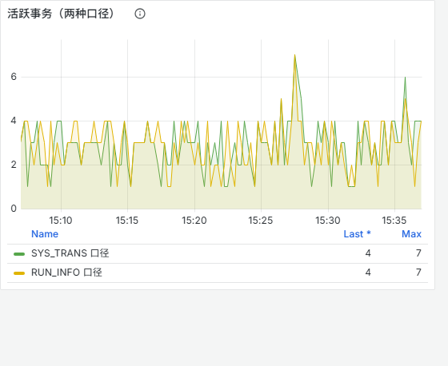

**涉及指标**：`xugu_active_transactions`、`xugu_transactions_active`

**说明**：两口径差异 ≈ 正在等待首个锁的事务数

#### 锁等待阻塞链（等待事务 ← 持有者会话）（明细表格）


**涉及指标**：`xugu_lock_wait_info`

**说明**：仅表级锁（LOCK TABLE/DDL）等待可见；行级锁阻塞不在此表，表现为长事务。对象名按 LOCK_ID 解析（官方编码：低32位=对象ID）。处理：按持有会话SID定位，确认后 kill 会话释放。

#### 当前持有排他类锁明细（X/IX/SIX）（明细表格）

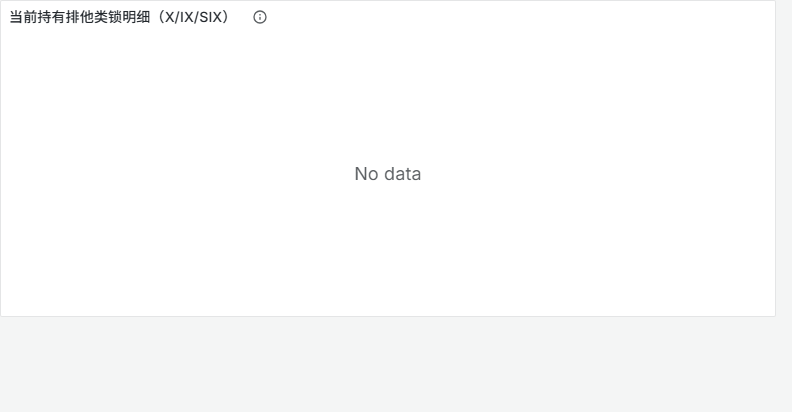

**涉及指标**：`xugu_lock_owner_info`

**说明**：谁的会话/事务正锁着什么对象（最多20条，实时口径 SYS_ALL_LOWNERS）。全局锁(SYS_GLOCKS)为懒释放非实时，不在此列

### 7.6 线程与对象

#### 工作线程状态分布（时序图）

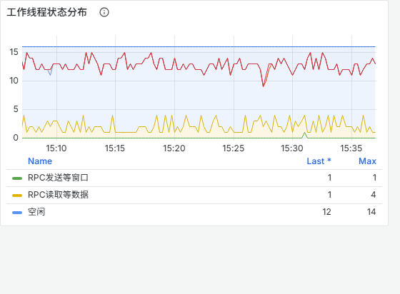

**涉及指标**：`xugu_worker_threads`

**说明**：TYPE=9 任务处理线程，状态按官方语义中文化；等锁/等资源类状态持续偏高需关注（行锁等待不计入，实测限制）

#### 事务号差（L06 风险）（时序图）

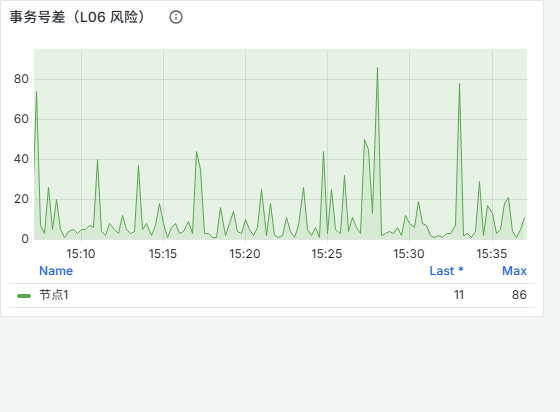

**涉及指标**：`xugu_transaction_id_span`

**说明**：最大-最小活动事务号之差，超过 600 万触发 L06 陈旧事务异常（官方文档）；持续增长说明有事务长期不结束

#### 失效对象（数值卡）


**涉及指标**：`xugu_invalid_objects`

**说明**：视图/过程/触发器/包 VALID=FALSE 总数；依赖变更后未重编译会失效，用 always-sql/依赖对象重编译.sql 生成修复脚本

#### 线程内存（按类型）（时序图）

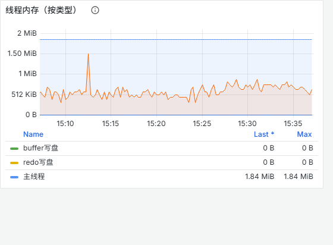

**涉及指标**：`xugu_threads_memory_bytes`

**说明**：各类型线程持有内存合计 Top6（类型已中文化）

#### 正在执行的 SQL（按已执行时长）（明细表格）

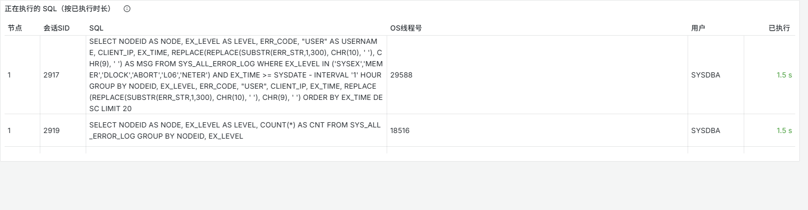

**涉及指标**：`xugu_active_statement_duration_seconds`

**说明**：来自 SYS_ALL_THD_SESSION（唯一能看到执行中语句文本的视图），含 exporter 自身采集查询。语句长时间无产出时，可在数据库服务器对 OS线程号 执行 pstack <线程号>（Linux）抓取堆栈定位卡点，或使用 scripts/diagnose-stuck-sql.sh 一键采集

#### 数据库存储占用（条形图）

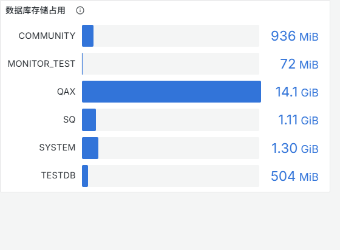

**涉及指标**：`xugu_database_storage_bytes`

**说明**：按库的存储段占用估算（存储段数×8MB，来源 SYS_GSTORES）

#### Top 存储对象（条形图）

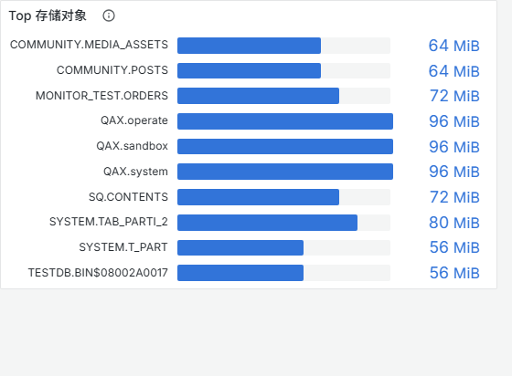

**涉及指标**：`xugu_object_storage_bytes`

**说明**：存储占用最大的 10 个表/索引对象（估算 存储段数×8MB）

#### Top 模式存储（条形图）

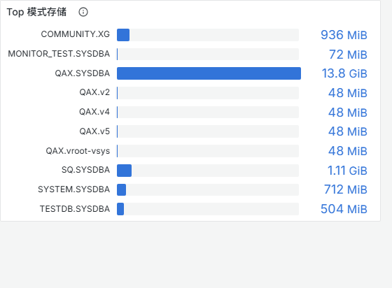

**涉及指标**：`xugu_schema_storage_bytes`

**说明**：存储占用最大的 10 个模式（用户表口径）

#### 存储碎片率（按库）（条形图）

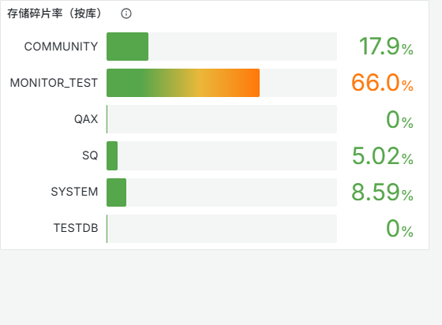

**涉及指标**：`xugu_storage_active_rows`、`xugu_storage_deleted_rows`

**说明**：标记删除行占比：UPDATE/DELETE 产生的逻辑碎片，空间可复用但高碎片影响扫描效率，可安排存储整理回收

### 7.7 集群拓扑（单机默认折叠）

#### 节点状态（明细表格）

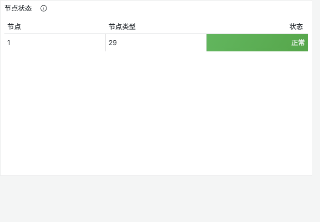

**涉及指标**：`xugu_node_state`

**说明**：NODE_STATE：0未联机/1刚加入/2正常/3出错/4宕机；节点类型为角色位掩码：1主M+2副M+4存储S+8查询Q+16工作W+32变更（29=M+S+Q+W）

#### 节点 CPU 负载（时序图）

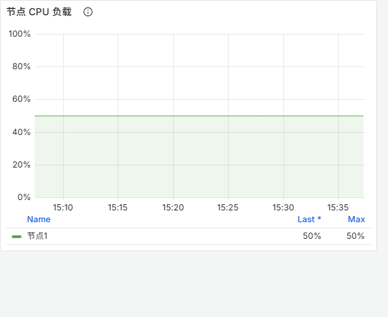

**涉及指标**：`xugu_node_cpu_load_percent`

**说明**：注意：12.0.0 单机实测恒为 50，疑似未实现的桩值，勿作容量依据；集群版本请自行复验

#### 存储段状态分布（时序图）


**涉及指标**：`xugu_gstores`

**说明**：健康态=1（实测）；扩容/修复期间出现其他状态码，长期不恢复需检查

#### 集群消息速率（时序图）


**涉及指标**：`xugu_cluster_messages_received_total`、`xugu_cluster_messages_sent_total`

**说明**：仅分布式集群产生数据；单机本面板无数据属正常

### 7.8 日志 / 安全 / 自监控（默认折叠）

#### 错误日志新增（按级别，5m）（时序图）

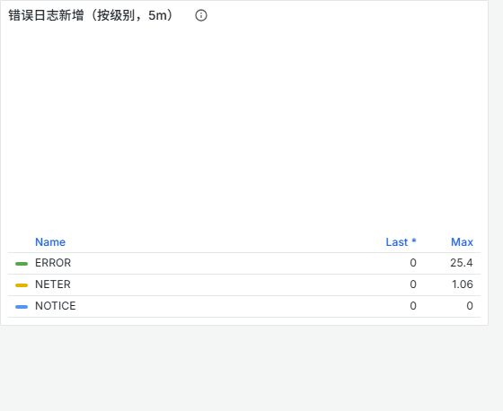

**涉及指标**：`xugu_errorlog_total`

**说明**：级别：NOTICE警告/USEREX用户/ERROR命令级/ABORT事务中止/DLOCK死锁/L06陈旧事务/SYSEX系统/NETER网络/MEMER内存错乱；日志按 errlog_size(默认100MB) 归档时计数回落

#### 事件日志新增（按类型，1h）（时序图）

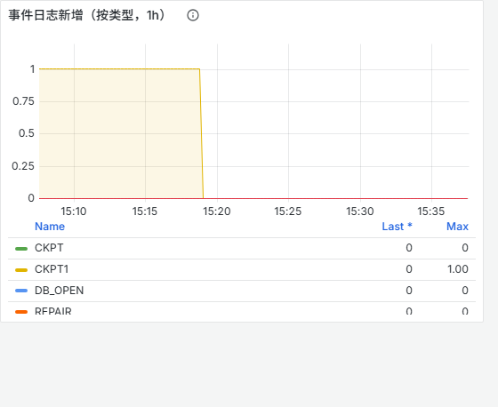

**涉及指标**：`xugu_eventlog_total`

**说明**：SYS_START=启动 CKPT=检查点 REPAIR=修复 DB_OPEN=库打开

#### 连接断开（NETER，1h）（数值卡）

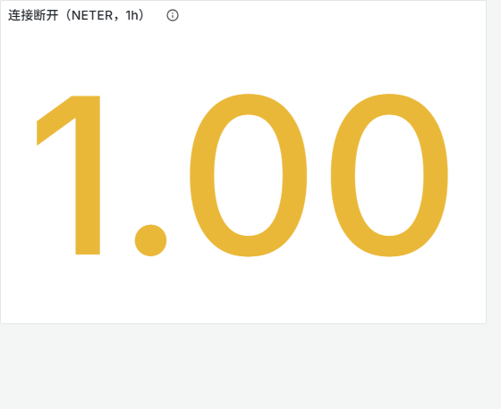

**涉及指标**：`xugu_errorlog_total`

**说明**：网络类错误(E1011 发送失败/客户端连接断开等)24小时新增；持续增长说明网络不稳或客户端异常退出

#### 安全与运维状态（数值卡）

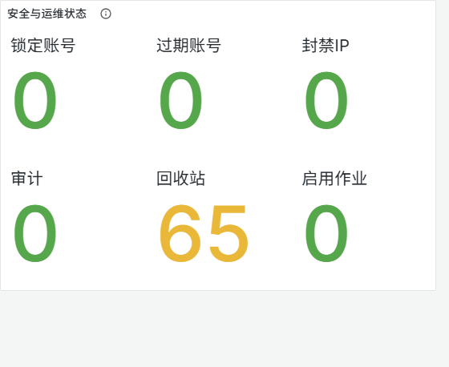

**涉及指标**：`xugu_forbidden_ips`、`xugu_jobs_enabled`、`xugu_recyclebin_objects`、`xugu_setting`、`xugu_users_expired`、`xugu_users_locked`

**说明**：锁定/过期账号与封禁 IP >0 时黄色提示；审计 1=开 0=关

#### 采集失败域数（数值卡）


**涉及指标**：`xugu_collector_success`

**说明**：失败域会以 xugu_collector_success=0 标出，查 exporter 日志定位

#### 采集域耗时 Top5（时序图）

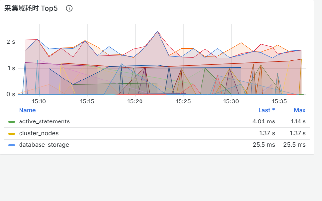

**涉及指标**：`xugu_collector_duration_seconds`

**说明**：errorlog 域因日志表全量扫描通常最慢（已加 TTL 缓存）

#### 抓取总耗时（时序图）

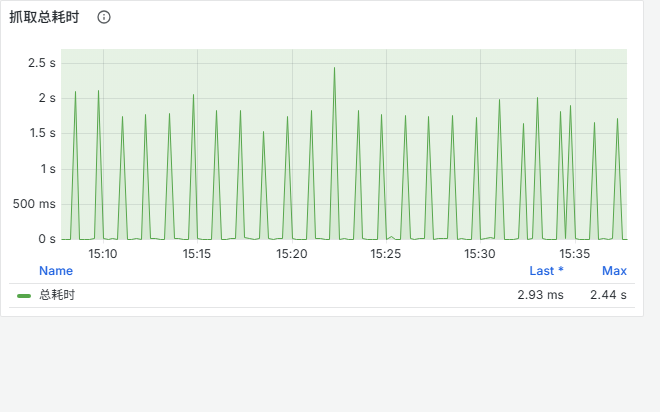

**涉及指标**：`xugu_exporter_scrape_duration_seconds`

**说明**：超过 scrape_timeout(默认10s) 会导致抓取失败

#### 重要级错误明细（近1小时）（明细表格）

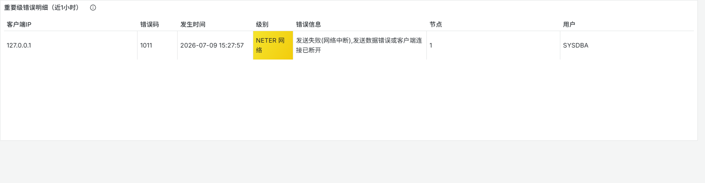

**涉及指标**：`xugu_errorlog_important_info`

**说明**：SYSEX系统/MEMER内存/DLOCK死锁/ABORT事务中止/L06陈旧事务/NETER网络 六类重要级别；ERROR/NOTICE 级多为使用错误不入明细。E19xxx=系统内存类致命，E14001=死锁

### 7.9 服务器资源

#### 服务器 CPU 使用率（时序图）

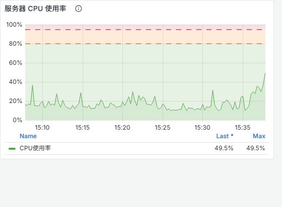

**涉及指标**：`xugu_host_cpu_usage_percent`

**说明**：exporter 内置采集(gopsutil)。注意：反映 exporter 所在机器——与数据库同机部署即数据库服务器画像；异机部署请设 host_metrics: false 并改用 node_exporter/windows_exporter。数据库自身 CPU_LOAD 字段为桩值不可用

#### 服务器内存（OOM 风险）（时序图）

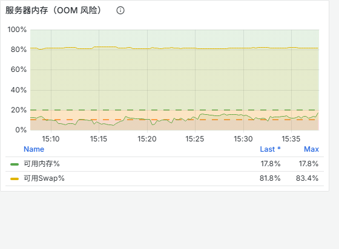

**涉及指标**：`xugu_host_memory_available_bytes`、`xugu_host_memory_total_bytes`、`xugu_host_swap_free_bytes`、`xugu_host_swap_total_bytes`

**说明**：可用内存持续 <10% 有 OOM 风险（数据库进程可能被系统杀死）

#### 磁盘剩余（数据目录所在盘，7天预测）（时序图）

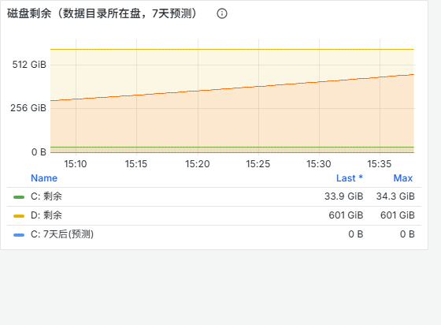

**涉及指标**：`xugu_host_disk_free_bytes`

**说明**：数据文件自动扩展(MAX_SIZE=-1)的硬限制是所在分区剩余空间；预测线触 0 即 7 天内写满

#### 数据库进程 / 异常堆栈文件（数值卡）


**涉及指标**：`xugu_host_db_processes`、`xugu_trc_files`

**说明**：虚谷为单进程架构（每节点一个进程），同机部署时应显示'运行中'；异常堆栈=数据库目录中的 exception_stack.trc（E19002 崩溃生成，单文件追加写）。显示'存在'请提交原厂解析，处理后移走文件；文件再次追加(新崩溃)有专项告警

#### 备份 / 归档文件落地实况（明细表格）

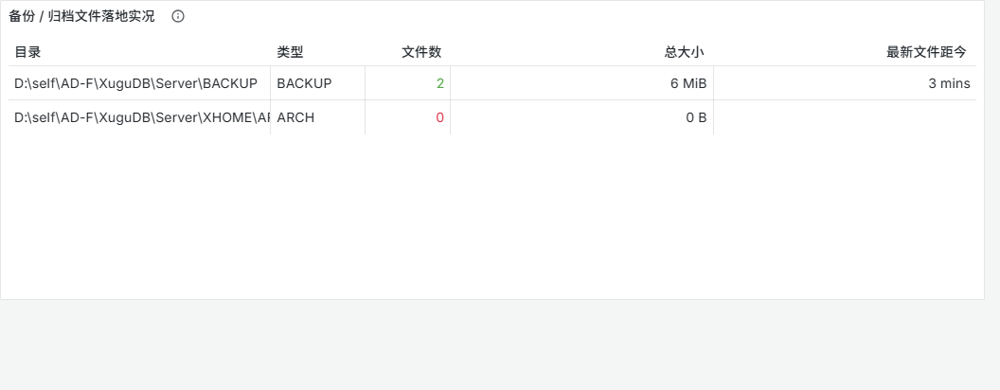

**涉及指标**：`xugu_backup_files`、`xugu_backup_files_size_bytes`、`xugu_backup_newest_file_timestamp_seconds`

**说明**：扫描 mount.ini 的 /BACKUP、/ARCH 物理目录得到的备份落地实况，与 SYS_BACKUP_PLANS(备份计划)互补：计划启用但文件数长期为 0 或最新文件距今过久，即备份未真正产生/已陈旧。异机部署时用 backup_dirs 指定目录

#### 备份新鲜度（数值卡）


**涉及指标**：`xugu_backup_newest_file_timestamp_seconds`

**说明**：最新备份文件距今时长。超过 24 小时告警(XuguBackupStale)；显示'无备份'且备份计划已启用会触发 XuguBackupMissing。备份文件落地口径，非备份计划配置

### 7.10 会话属性（默认折叠）

#### 会话属性分布（明细表格）

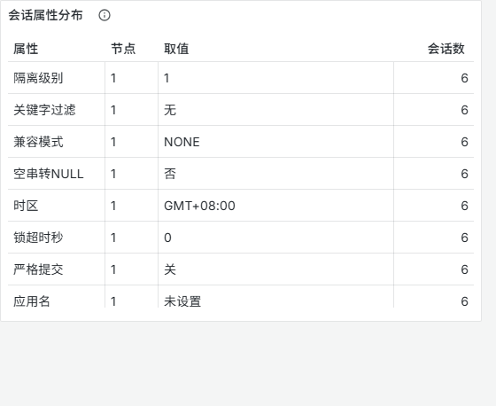

**涉及指标**：`xugu_sessions_by_attribute`

**说明**：全部连接按 10 类属性的取值分布：字符集/时区/自动提交/隔离级别/兼容模式/空串转NULL/严格提交/锁超时/关键字过滤/应用名。同一属性出现多个取值即存在配置漂移，可据此发现字符集不一致、意外兼容模式等问题。SSL 为连接串侧属性，服务端无会话级视图

#### 保持最久的连接明细（明细表格）

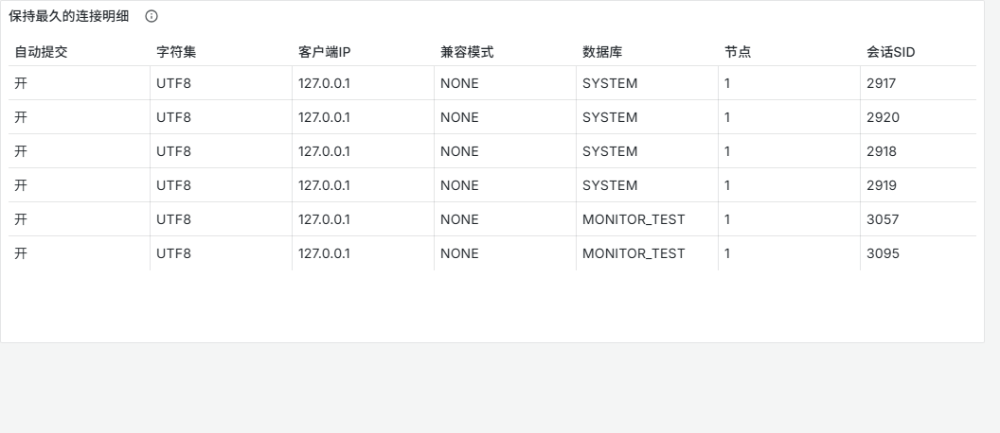

**涉及指标**：`xugu_session_detail_age_seconds`

**说明**：保持时间最久的 10 个连接及其属性（用户/库/IP/字符集/时区/自动提交/兼容模式）。长期不释放的连接可据此定位应用连接池配置；配合 max_idle_time 参数管理空闲连接

#### 最长连接保持时长（时序图）

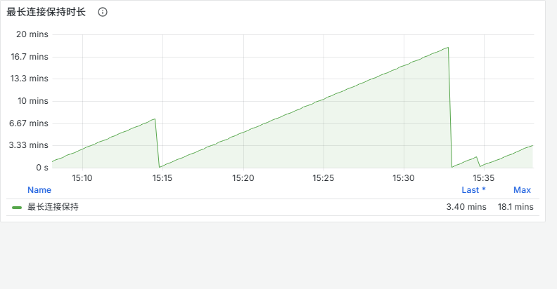

**涉及指标**：`xugu_session_oldest_connect_timestamp_seconds`

**说明**：最早建立连接至今的时长；持续增长属正常（常驻连接池），关注点是其与 max_idle_time 的关系以及是否存在预期外的常驻连接

#### 会话内存（合计 / 单会话峰值）（时序图）

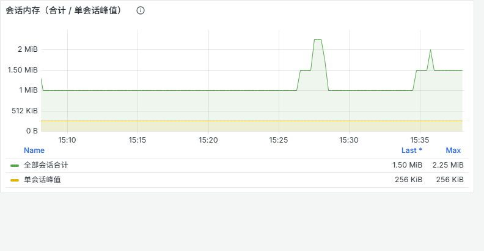

**涉及指标**：`xugu_session_memory_max_bytes`、`xugu_sessions_memory_bytes`

**说明**：连接内存消耗：合计反映连接规模成本，单会话峰值异常偏大提示大结果集/大排序


## 8. 文档清单

| 文档 | 内容 |
|------|------|
| deployment-guide.md | 部署说明手册：部署方式、配置项、验收清单、故障处理 |
| metrics-reference.md | 指标清单与来源 SQL 对照（44 采集域 82 指标） |
| metrics-design.md | 指标设计说明与历史版本指标迁移对照 |
| test-report.md | 测试报告 |
| field-validation-matrix.md | 系统字典字段有效性参考 |
| xugudb-reference-notes.md | XuguDB 系统字典与运行行为参考 |
| package-manifest.md | 产品包清单与文件结构 |
