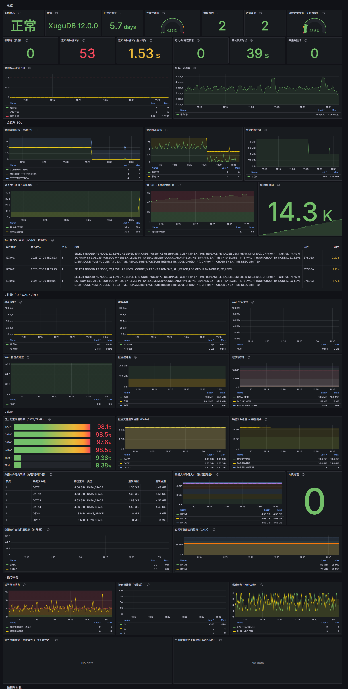
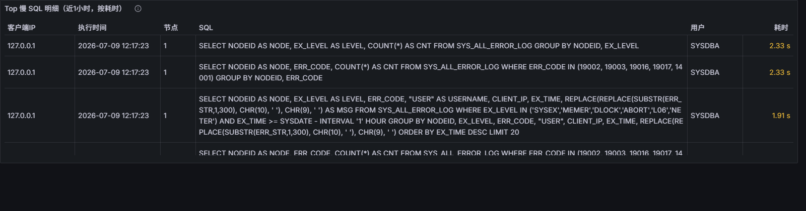
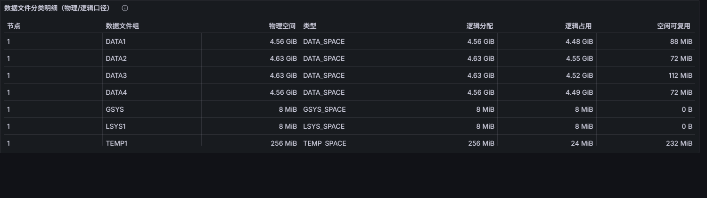
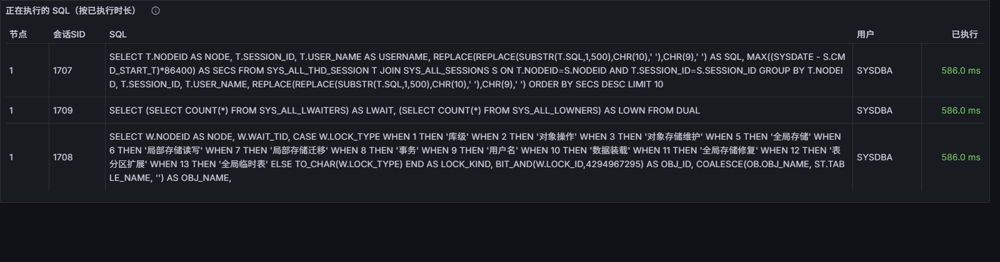
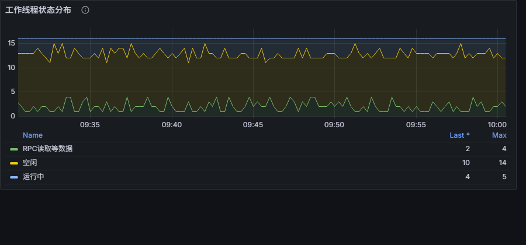
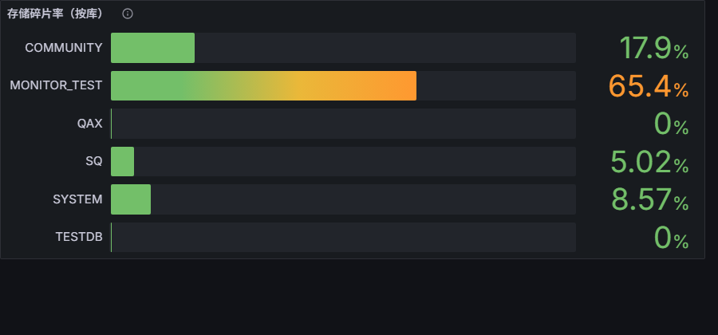
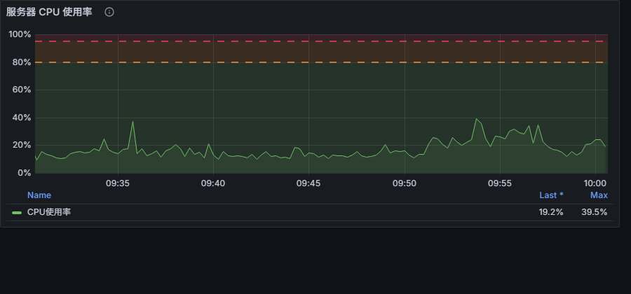

# 虚谷数据库监控系统（xugu-exporter）产品手册

**版本**：v1.1.0
**适用数据库**：虚谷数据库（XuguDB）12.x 系列
**文档类别**：产品说明

---

## 1. 产品概述

xugu-exporter 是面向虚谷数据库的 Prometheus 监控采集与可视化套件，提供数据库运行状态、性能、容量、锁与事务、日志与安全、服务器资源的完整监控能力。产品由指标采集器、Grafana 仪表盘、Prometheus 告警规则与自动化验证工具四部分组成，开箱即用，亦支持不修改代码的深度定制。

指标体系与虚谷数据库系统字典深度对齐，全部指标附带中文统计口径说明。

## 2. 系统架构与组成

```
┌──────────────┐  SQL   ┌───────────────┐  HTTP /metrics  ┌────────────┐      ┌─────────┐
│  XuguDB      │◄───────│ xugu-exporter │────────────────►│ Prometheus │─────►│ Grafana │
│ (SYSTEM 库)  │        │  (单二进制)    │                 │ (含告警规则) │      │ (仪表盘) │
└──────────────┘        └───────────────┘                 └────────────┘      └─────────┘
```

| 组件 | 交付物 | 说明 |
|------|--------|------|
| 指标采集器 | 六平台二进制（bin/） | 44 个采集域，82 个数据库指标；内置服务器资源采集 |
| 可视化 | dashboards/xugu-overview.json | Grafana 仪表盘，9 个功能分区、65 个面板 |
| 告警 | rules/xugu-alerts.yml | 27 条 Prometheus 告警规则，中文说明与处置指引 |
| 部署套件 | deploy/ | Docker Compose 演示栈、systemd 单元、Prometheus/Grafana 配置模板 |
| 环境自检工具 | tools/verify 等 | 部署后与数据库版本变更后的一键回归自检 |

## 3. 功能规格

### 3.1 功能说明（按分区）

以下按仪表盘分区说明各功能的用途、正常表现与异常识别方法。

#### 总览

- **用途**：一屏判断数据库整体健康度。两排 KPI 覆盖可用性、连接、事务、锁、慢 SQL、错误、磁盘余量与采集健康。
- **正常表现**：实例状态"正常"（绿）；连接使用率低于 80%；锁等待为 0；采集失败域为 0；磁盘剩余最低高于 20%。
- **异常表现与处置**：实例状态"宕机"（红）→ 数据库不可连接，检查进程与网络；连接使用率进入橙/红区 → 接近 max_conn_num 上限，排查连接泄漏或调大参数；最长事务时长持续增长 → 转锁与事务分区排查（可能为行锁互等）；采集失败域 > 0 → 对应面板无数据，查采集器日志。

#### 会话与 SQL

- **用途**：定位连接来源、识别失控查询、追踪慢 SQL。
- **正常表现**：会话状态以"空闲"为主；最长执行语句在秒级波动；慢 SQL 窗口计数低位。
- **异常表现与处置**：某库/用户会话数突增 → 来源分布图定位应用；最长执行语句持续攀升 → 在"正在执行的 SQL"表按 OS 线程号执行 `pstack <线程号>` 抓取堆栈（或运行 scripts/diagnose-stuck-sql.sh）；慢 SQL 突增 → Top 慢 SQL 明细表直接查看语句文本、用户与来源 IP。

#### 性能

- **用途**：观察 IO 压力、写入负载与内存缓冲健康。
- **正常表现**：WAL 写入速率与业务写入量正相关；检查点延迟呈锯齿状回落；缓冲池空闲充足。
- **异常表现与处置**：物理读持续高 → 缓冲池偏小或存在大扫描（注意：数据全在缓冲池时物理读为 0 属正常）；检查点延迟持续超过 2GB 不回落 → 检查刷盘配置，宕机恢复时间将变长；脏页占比持续走高 → 写盘能力不足。

#### 容量

- **用途**：按虚谷存储模型（物理空间/逻辑分配/逻辑占用/空闲可复用）监控数据文件与磁盘余量。
- **正常表现**：数据文件按 STEP_SIZE 台阶式扩展（扩展检测图出现台阶属正常行为）；已分配使用率高不构成风险；空闲可复用空间随删除/整理回升。
- **异常表现与处置**：磁盘剩余最低进入橙/红区或 7 天预测线触 0 → 数据文件扩展将耗尽磁盘，扩容或清理；介质错误 > 0 → 磁盘硬件故障，立即检查存储设备；扩展过于频繁 → 关注写入放大与磁盘余量。

#### 锁与事务

- **用途**：发现阻塞、定位持有者、监控事务健康。
- **正常表现**：锁等待为 0；阻塞链表格为空；两种口径的活跃事务数基本一致。
- **异常表现与处置**：锁等待 > 0 → 阻塞链表格给出"等待事务 ← 持有会话 SID + 锁类型 + 对象名"，确认后 `EXEC DBMS_DBA.KILL_TRANS(节点ID, 事务ID);`；最长事务持续增长且阻塞链为空 → 大概率为行级锁互等（行锁不进入锁等待视图，包括死锁场景，该版本无死锁自动检测），结合"正在执行的 SQL"与排他锁持有明细定位后人工终止。

#### 线程与对象

- **用途**：内核线程健康、L06 风险预警、失效对象、执行中 SQL、三级存储分布与碎片。
- **正常表现**：工作线程以"空闲/运行中"为主；事务号差远低于 600 万；失效对象为 0；碎片率低位。
- **异常表现与处置**：等锁/等资源类线程状态持续偏高 → 结合锁分区与 IO 排查；事务号差超 300 万告警 → 存在长期不结束的事务，600 万将触发 L06 陈旧事务异常；失效对象 > 0 → 用 always-sql/依赖对象重编译.sql 生成修复脚本；碎片率超阈值 → 标记删除行占比高，安排存储整理。

#### 集群拓扑（单机默认折叠）

- **用途**：节点存活、角色、存储段健康与节点间通讯质量。
- **正常表现**：全部节点状态"正常"；存储段状态码 1；消息重发/丢弃计数不增长。
- **异常表现与处置**：节点状态出错/宕机 → 检查节点进程与心跳网络；存储段非健康态持续 → 扩容/修复中属正常，长期不恢复检查存储副本；消息重发/丢弃增长 → 节点间网络异常。

#### 日志 / 安全 / 自监控（默认折叠）

- **用途**：错误分级趋势、重要错误明细、连接断开、安全事件与采集器自身健康。
- **正常表现**：错误日志以低级别为主；重要级错误明细为空；无锁定账号与封禁 IP。
- **异常表现与处置**：SYSEX/MEMER 级出现 → 系统级故障，结合致命错误告警与 trc 文件处置；DLOCK 出现 → 数据库上报了死锁事件；NETER 持续增长 → 网络不稳或客户端异常退出；账号锁定/IP 封禁 → 核实是否暴力破解。

#### 服务器资源

- **用途**：数据库服务器 CPU/内存/磁盘与进程存活、异常堆栈文件检测（采集器内置，开箱即用）。
- **正常表现**：数据库进程显示"运行中"（虚谷为单进程架构，每节点一个进程）；异常堆栈显示"无"；可用内存高于 20%。
- **异常表现与处置**：可用内存低于 10% → OOM 风险，数据库进程可能被系统终止；异常堆栈显示"存在" → 数据库目录发现 exception_stack.trc（E19002 系统存取保护事故生成，单文件追加写），将文件提交原厂映射解析，处理后移走文件；文件内容再次追加（XuguTrcFileGrowing 告警）→ 发生了新的崩溃事件；进程"未检测到"且实例宕机 → 数据库进程已退出，结合 trc 文件与事件日志定位。

### 3.2 采集器技术特性

| 特性 | 规格 |
|------|------|
| 部署形态 | 单二进制，静态编译，无外部依赖 |
| 采集方式 | 配置驱动：全部采集 SQL 外置于 YAML，支持外置文件覆盖同名采集域 |
| 单机/集群一体化 | 统一使用 SYS_ALL_ 全局虚表；集群专属采集域按节点数自动启停 |
| 结果缓存 | 采集域级 TTL 缓存；支持全局 default_ttl 统一降频 |
| 错误隔离 | 单采集域失败不影响其他域，失败状态通过 xugu_collector_success 指标暴露 |
| 序列保护 | 采集引擎内置重复时间序列去重，保障自定义 SQL 场景下指标输出可用性 |
| 服务器资源采集 | 内置跨平台主机采集（CPU/内存/磁盘），可配置关闭 |
| 参数辅助 | 支持启动时自动设置数据库慢 SQL 阈值（set_slow_sql_time） |
| 自监控 | 抓取总耗时、各采集域耗时与成败状态 |

### 3.3 指标体系

- 数据库指标 82 项（44 个采集域），完整清单与来源 SQL 对照见《metrics-reference.md》；
- 引擎指标 4 项（可用性、抓取耗时、采集域成败/耗时）；
- 服务器与进程指标 11 项（xugu_host_ / xugu_trc_ 前缀：CPU/内存/磁盘/数据库进程存活/异常堆栈文件）；
- 命名遵循 Prometheus 规范：容量 `_bytes`、时刻 `_timestamp_seconds`、时长 `_seconds`、累计 `_total`；
- 全部指标携带中文 help，注明统计口径与适用限制。

### 3.4 告警规格（27 条）

| 分组 | 规则 | 触发条件 | 级别 |
|------|------|----------|------|
| 可用性 | XuguInstanceDown | 数据库连续 1 分钟不可连接 | critical |
| 可用性 | XuguExporterCollectorFailed | 采集域持续失败 10 分钟 | warning |
| 可用性 | XuguNodeRestarted | 节点启动时间在 5 分钟内 | warning |
| 连接 | XuguTooManySessions / XuguSessionsSaturated | 会话数超上限 80%（5m）/ 95%（1m） | warning / critical |
| 性能 | XuguSlowSQLBurst | 近 10 分钟慢 SQL 超过 20 条 | warning |
| 性能 | XuguCheckpointLagHigh | 检查点延迟超过 2GB，持续 10 分钟 | warning |
| 性能 | XuguLongStatement | 单语句执行超过 10 分钟 | warning |
| 锁与事务 | XuguLockWaiting | 表级锁等待持续 3 分钟 | warning |
| 锁与事务 | XuguLongTransaction | 最老事务超过 30 分钟 | warning |
| 锁与事务 | XuguTransIdSpanHigh | 活动事务号差超过 300 万 | warning |
| 致命错误 | XuguFatalError | 出现 19002/19003/19016/19017/14001 错误码 | critical |
| 致命错误 | XuguTrcFileDetected | 数据库目录存在异常堆栈文件 | critical |
| 致命错误 | XuguTrcFileGrowing | 异常堆栈文件出现新增内容（新崩溃） | critical |
| 致命错误 | XuguDBProcessMissing | 本机未检测到数据库进程（同机部署） | warning |
| 容量 | XuguTablespaceMediaError | 数据文件介质错误 | critical |
| 主机 | XuguHostMemoryLow | 可用内存低于 10%，持续 5 分钟 | warning |
| 主机 | XuguHostDiskLow | 磁盘分区剩余低于 10%，持续 10 分钟 | warning |
| 主机 | XuguHostDiskFullIn7Days | 按 1 天趋势外推 7 天内磁盘写满 | warning |
| 主机 | XuguDatafileExtended | 数据文件发生自动扩展 | info |
| 日志 | XuguErrorLogBurst | 5 分钟内 ERROR 级日志新增超过 50 条 | warning |
| 集群 | XuguClusterNodeAbnormal | 节点状态码非正常值 | critical |
| 集群 | XuguClusterNodeCountChanged | 集群节点数量变化 | warning |
| 集群 | XuguGlobalLockWaiting | 全局锁等待超过 10，持续 5 分钟 | warning |
| 集群 | XuguStoreAbnormal | 存储段非健康状态持续 30 分钟 | warning |
| 安全 | XuguAccountLocked | 存在锁定账号超过 10 分钟 | info |
| 安全 | XuguForbiddenIPDetected | 30 分钟内出现新增封禁 IP | warning |

> 容量说明：数据文件为自动扩展模式，已分配空间使用率不设告警；容量风险统一以数据文件所在磁盘的剩余空间衡量。

## 4. 运行环境

| 项目 | 要求 |
|------|------|
| 数据库 | XuguDB 12.x；监控账号需 SYSTEM 库系统表查询权限 |
| 采集器操作系统 | Linux（x86 32 位 / x86_64 / ARM64）、Windows x86_64、macOS（Intel / Apple Silicon） |
| Prometheus | 2.x / 3.x |
| Grafana | 10.0 及以上 |
| 资源占用 | 采集器常驻内存约 30MB；默认对数据库产生 4 个连接、每抓取周期约 1.5 秒查询耗时（可通过 TTL 降频） |

## 5. 使用说明与已知限制

以下为 XuguDB 12.x 环境下的使用说明与已知限制，详细参考见《xugudb-reference-notes.md》。

1. **连接要求**：采集连接串必须指向 SYSTEM 库；分布式环境可使用 `IPS=ip1,ip2` 多地址负载均衡。
2. **缓冲命中率与网络吞吐**：XuguDB 12.x 不提供相应系统计数器，本产品不包含该两类指标；缓冲健康度由缓冲池使用率与脏页占比反映，写入负载由 WAL 写入速率反映。
3. **行级锁可观测性**：锁等待视图仅记录表级锁；行级锁互等（包括死锁，且该版本不进行死锁自动检测）在监控上表现为长事务。产品通过最长事务时长、事务号差两项指标与对应告警实现兜底发现，处置命令为 `EXEC DBMS_DBA.KILL_TRANS(节点ID, 事务ID);`。
4. **容量口径**：使用率类指标为已分配空间口径。数据文件在 MAX_SIZE=-1 时按 STEP_SIZE 自动扩展，磁盘剩余空间为实际硬限制；系统空间（GSYS/UNDO/LSYS）无空闲显示属正常形态；逻辑空闲空间可复用，物理文件不自动收缩。
5. **服务器资源指标口径**：xugu_host_ 指标反映采集器所在主机。采集器与数据库同机部署时即数据库服务器资源；异机部署应设置 `host_metrics: false`，并在数据库服务器部署 node_exporter（Linux）或 windows_exporter（Windows）。
6. **日志类计数器**：日志表按 errlog_size（默认 100MB）滚动归档，归档时累计计数回落，速率曲线出现短暂负值后恢复属正常现象。
7. **明细文本长度**：SQL 明细截断至 500 字符、错误信息截断至 300 字符；表格单元格支持点击放大查看，完整文本可按时间戳在数据库中查询。
8. **采集器自身可见性**：活跃会话、正在执行的 SQL 等实时视图包含采集器自身的查询；排他锁持有明细已过滤系统表自锁。
9. **性能控制**：提供三层控制手段——按域关停（disabled_groups）、全局降频（default_ttl）、整体关停并白名单启用（disable_default_metrics + metrics_files）。errorlog 采集域为日志表全量扫描，日志规模较大的环境建议优先配置。
10. **集群指标**：全局锁、集群消息等采集域在单机环境自动停用；集群环境下的字段有效性建议使用随附验证工具复验。

## 6. 定制能力

| 定制项 | 方式 |
|--------|------|
| 修改/新增采集 SQL | 外置 metrics_files YAML 文件，同名采集域覆盖内置定义，无需重新编译 |
| 修改仪表盘 | 编辑 tools/gen_dashboard.py 后重新生成，生成过程自动校验指标引用有效性 |
| 修改告警阈值 | 直接编辑 rules/xugu-alerts.yml |
| 环境回归自检 | 运行 tools/verify，一键完成采集与指标体系的环境适配性检查 |

## 7. 功能图示

### 7.1 监控全景（9 分区 65 面板）



### 7.2 Top 慢 SQL 明细

语句文本最长 500 字符自动换行展示，单元格支持点击放大查看；按耗时着色排序。



### 7.3 数据文件分类明细（物理/逻辑口径）

按数据文件组展示物理空间、逻辑分配、逻辑占用与空闲可复用四个口径。



### 7.4 正在执行的 SQL

实时展示执行中语句的会话、用户、语句文本与已执行时长。



### 7.5 工作线程状态分布

27 种线程状态中文语义堆叠展示。



### 7.6 存储碎片率（按库）

标记删除行占比，用于评估存储整理需求。



### 7.7 服务器资源

采集器内置主机采集，CPU/内存/磁盘开箱即用。



### 7.8 数据库进程与异常堆栈检测

进程存活与 E19002 崩溃产物（exception_stack.trc）自动检测；文件存在与内容追加（新崩溃）均有专项告警。


## 8. 文档清单

| 文档 | 内容 |
|------|------|
| deployment-guide.md | 部署说明手册：部署方式、配置项、验收清单、故障处理 |
| metrics-reference.md | 指标清单与来源 SQL 对照（44 采集域 82 指标） |
| metrics-design.md | 指标设计说明与历史版本指标迁移对照 |
| test-report.md | 测试报告 |
| field-validation-matrix.md | 系统字典字段有效性参考 |
| xugudb-reference-notes.md | XuguDB 系统字典与运行行为参考 |
| package-manifest.md | 产品包清单与文件结构 |
